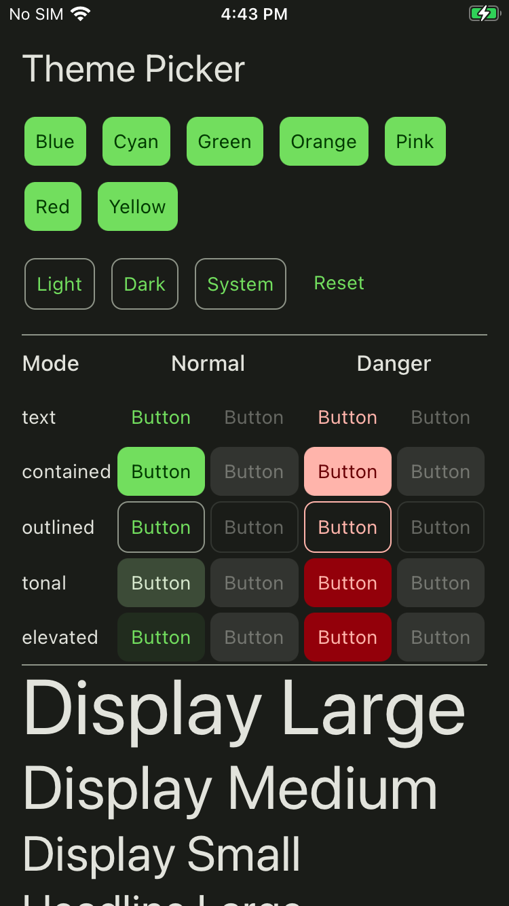
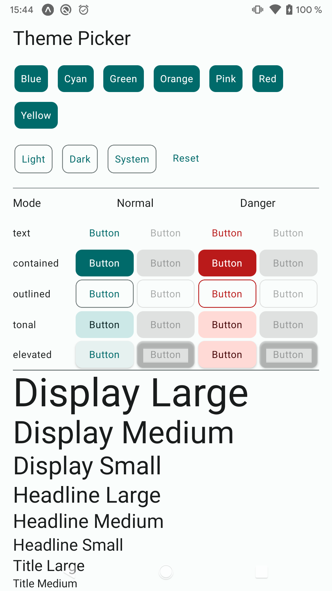

<div align="center">

# React Native Expressive

Utilities and UI components for cross-platform React Native apps

<!-- BADGES -->
[](https://psas.dev/purely-personal)
[](https://github.com/thehale/react-native-expressive/blob/master/LICENSE)
[](https://github.com/sponsors/thehale)
[](https://jhale.dev)
[](https://www.linkedin.com/comm/mynetwork/discovery-see-all?usecase=PEOPLE_FOLLOWS&followMember=thehale)
    
    



</div>


## Installation

```sh
npm install react-native-expressive
```

<details>
  <summary><strong>Submodule Usage</strong></summary>

This library can also be used as a [Git
Submodule](https://git-scm.com/book/en/v2/Git-Tools-Submodules), which can
enable hot reloading of library codes changes.

The tradeoff is the host app is then responsible for including the library's
dependencies directly within the host's `package.json` and configuring any
needed aliases to resolve library items from the submodule path.

**Install the submodule**

```bash
git submodule add https://github.com/thehale/react-native-expressive.git lib/react-native-expressive
```

**Install the submodule's dependencies**

```bash
node ./lib/react-native-expressive/script/install-dependencies-in-host.js
```

**Configure Aliases**

_babel.config.js_
```diff
module.exports = {
  plugins: [
+    [
+      'module-resolver',
+      {
+        extensions: ['.ios.js', '.android.js', '.ios.jsx', '.android.jsx', '.js', '.jsx', '.json', '.ts', '.tsx'],
+        root: ['.'],
+        alias: {
+          'react-native-expressive': './lib/react-native-expressive/src',
+        },
+      },
+    ]
  ]
}
```

_tsconfig.json_
```diff
{
  "compilerOptions": {
    "paths": {
+      "react-native-expressive": ["./lib/react-native-expressive/src"]
    }
  }
}
```

> [!TIP]
> You may have to `npx react-native clean` the Metro and npm caches followed by an
> app reinstall.

> [!TIP]
> Make sure your `react-native-expressive` submodule does **NOT** have a
> `node_modules` folder as that can break Metro's module resolution.

</details>

## Usage


See the [example app](example/src/App.tsx)


## Contributing

- [👀 START HERE!](CONTRIBUTING.md#start-here)
- [Development workflow](CONTRIBUTING.md#development-workflow)
- [Sending a pull request](CONTRIBUTING.md#sending-a-pull-request)
- [Code of conduct](CODE_OF_CONDUCT.md)

## License
Copyright (c) 2025 Joseph Hale, All Rights Reserved

Provided under the terms of the [Mozilla Public License, version 2.0](./LICENSE)

<details>

<summary><b>What does the MPL-2.0 license allow/require?</b></summary>

### TL;DR

You can use files from this project in both open source and proprietary
applications, provided you include the above attribution. However, if
you modify any code in this project, or copy blocks of it into your own
code, you must publicly share the resulting files (note, not your whole
program) under the MPL-2.0. The best way to do this is via a Pull
Request back into this project.

If you have any other questions, you may also find Mozilla's [official
FAQ](https://www.mozilla.org/en-US/MPL/2.0/FAQ/) for the MPL-2.0 license
insightful.

If you dislike this license, you can contact me about negotiating a paid
contract with different terms.

**Disclaimer:** This TL;DR is just a summary. All legal questions
regarding usage of this project must be handled according to the
official terms specified in the `LICENSE` file.

### Why the MPL-2.0 license?

I believe that an open-source software license should ensure that code
can be used everywhere.

Strict copyleft licenses, like the GPL family of licenses, fail to
fulfill that vision because they only permit code to be used in other
GPL-licensed projects. Permissive licenses, like the MIT and Apache
licenses, allow code to be used everywhere but fail to prevent
proprietary or GPL-licensed projects from limiting access to any
improvements they make.

In contrast, the MPL-2.0 license allows code to be used in any software
project, while ensuring that any improvements remain available for
everyone.

</details>

---

Made with [create-react-native-library](https://github.com/callstack/react-native-builder-bob)
